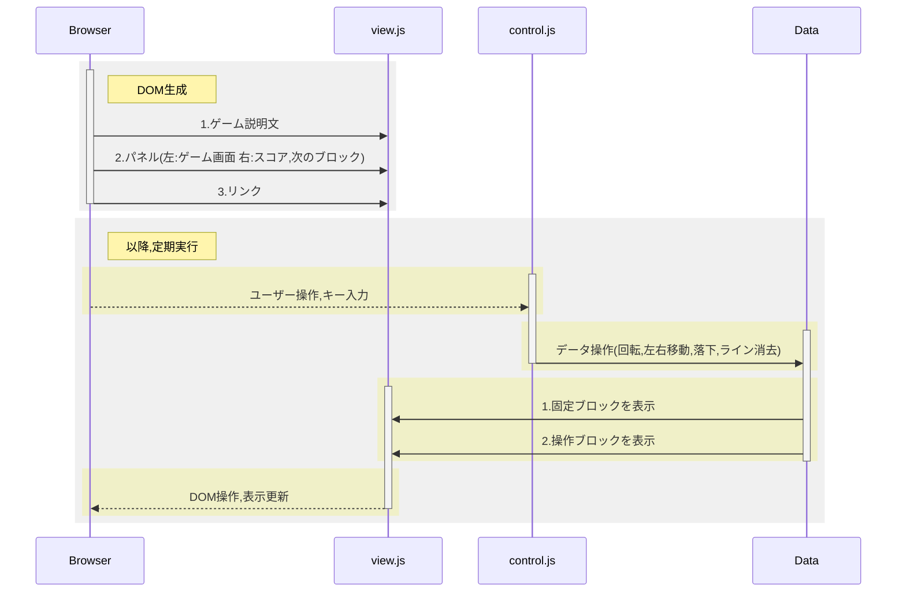

# Tetris in 

# 制作風景

やっぱり動いたり操作できるのは楽しい!!

この講習で見た目をいじる手段を学べたのが本当に大きい

# 学んだこと、総動員

- deep/shallow copy でハマる...
  - ブロックが表示されず、ずっと真っ白状態
- ブロックの衝突判定でハマる...
  - 回転で、壁にめり込む特別仕様
- 何故か、github.io 上では表示が違う...
  - 色んなブラウザでチェックするとブラウザ独自の CSS があたっていたりするので注意
  - CSS が更新されないときは **Shift 押しながら更新**

# Tetris で工夫したこと

- タイトル部分以外は DOM 操作で生成
  - JS 操作で機能追加が簡単
  - 動的に生成しているので,定数を変更すれば,色々と変更できるように
- 操作する関数(`control.js`)と表示する関数(`view.js`)を分離する
  - ボタンを増やしたり,スマホ対応が簡単

# 参考

